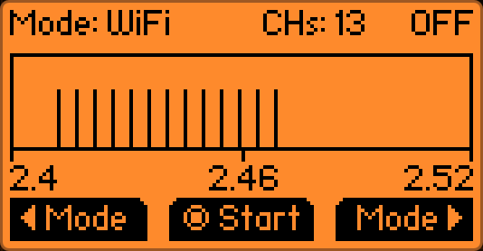

# FlipperzeroNRFJammer

This Flipperzero NRF24 Jammer is a fork of the original version of [huuck/FlipperZeroNRFJammer](https://github.com/huuck/FlipperZeroNRFJammer) for the 2.4 GHz spectrum.  
Tested on the Momentum Firmware.

## 🔊 Jamming Modes

- **Bluetooth**: This mode performs frequency hopping across 79 channels, ranging from **2.402 GHz to 2.480 GHz**, with each channel spaced 1 MHz apart — matching the classic Bluetooth specification.

- **Wi-Fi**: In this mode, the jammer targets **13 used Wi-Fi channels** within the **2.400 GHz to 2.480 GHz** range, which covers most 2.4 GHz WLAN traffic.

- **full**: This mode performs a wide sweep across the entire **2.4 GHz ISM band**, from **2.400 GHz up to 2.525 GHz**, jamming potentially any protocol using this spectrum.

## UI

## 🚀 How to Use

1. Compile the app or download the precompiled `.fap` file and place it inside `apps/GPIO/NRF24`
2. Connect your **NRF24** module to the Flipper’s **GPIO pins**
3. Enable **5V power** on the GPIO
4. Launch the **NRF Jammer** app on your Flipper
5. Use **Left/Right** to switch between jamming modes
6. Press **OK** to Start/Stop jamming
7. Press **Back** to stop/exit

## 🙏 Credits

- This project is a **fork** of the original [FlipperZeroNRFJammer](https://github.com/huuck/FlipperZeroNRFJammer) by [huuck](https://github.com/huuck), which provided the base structure and core logic of the app.

## ⚠️ Disclaimer

This software is provided **for educational and research purposes only**.  
The use of RF jamming devices is **strictly regulated or prohibited** in many countries due to the potential to interfere with licensed communications, public infrastructure, or other devices.

By using this tool, **you take full responsibility** for ensuring that your activities comply with all applicable **local, national, and international laws and regulations**.  
The developers and contributors of this project **do not condone malicious use**, and are **not liable for any misuse, damage, or legal consequences** resulting from the use of this software.

> **Do not use this tool in unauthorized or public environments. Only test in controlled, private settings where you have explicit permission.**
